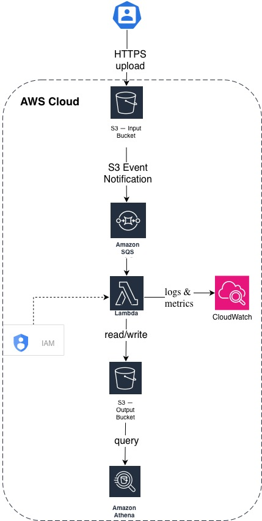

# Case 02 — Event-driven Pipeline

## Problem Statement

A company receives CSV files from clients containing daily sales data.
These files need to be processed, transformed, and made available for
analytical queries. The team has no infrastructure expertise and file
volume is unpredictable — from a few files per day to hundreds during
peak periods.

## Requirements

**Functional**
- Clients upload CSV files via HTTPS
- Files are automatically processed after upload
- Processed data is available for SQL queries
- Failed processing must be retried automatically

**Non-functional**
- Fully managed, no server administration
- Processing must be decoupled from upload (async)
- At-least-once delivery guarantee
- Cost proportional to actual usage

## Constraints

- Team size: 2 engineers, no DevOps
- Files up to 100 MB each
- Query results needed within 5 minutes of upload

## Architecture Overview

**Services chosen:**
- **S3 (input bucket)** — receives uploaded CSV files
- **SQS** — decouples upload event from processing, enables retry
- **Lambda** — processes and transforms CSV data
- **S3 (output bucket)** — stores transformed data in Parquet format
- **Athena** — serverless SQL queries over S3 data
- **CloudWatch** — logs, metrics and dead-letter queue alerts
- **IAM** — least-privilege roles between services

## Documents

- [Architecture Decision Record](./ADR.md)
- [Cost Estimate](./cost-estimate.md)
